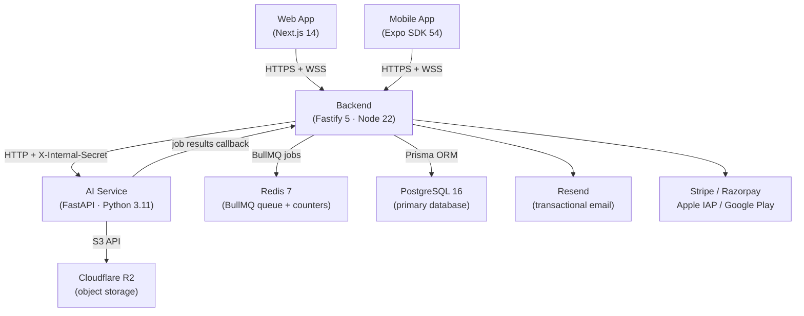
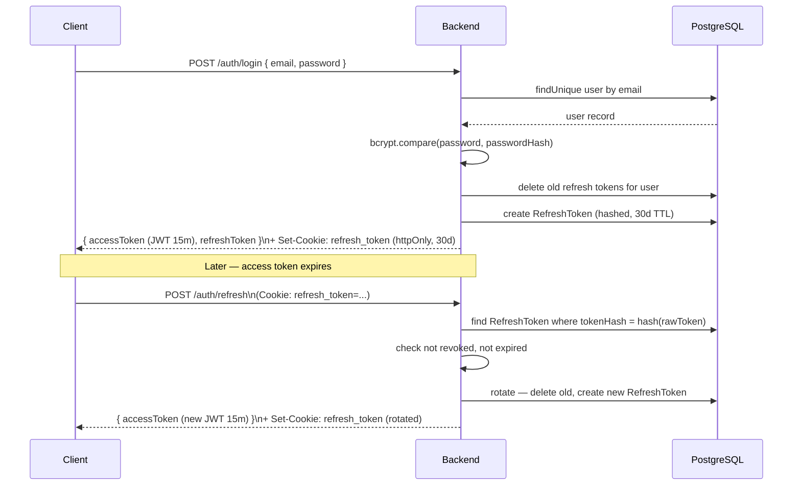
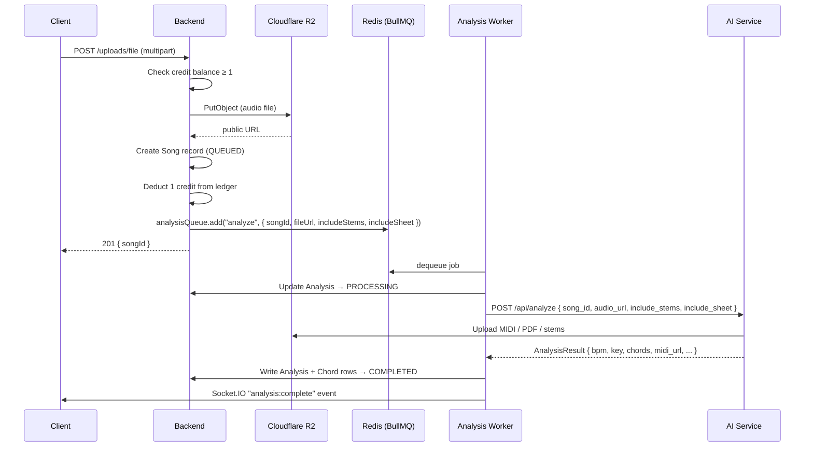
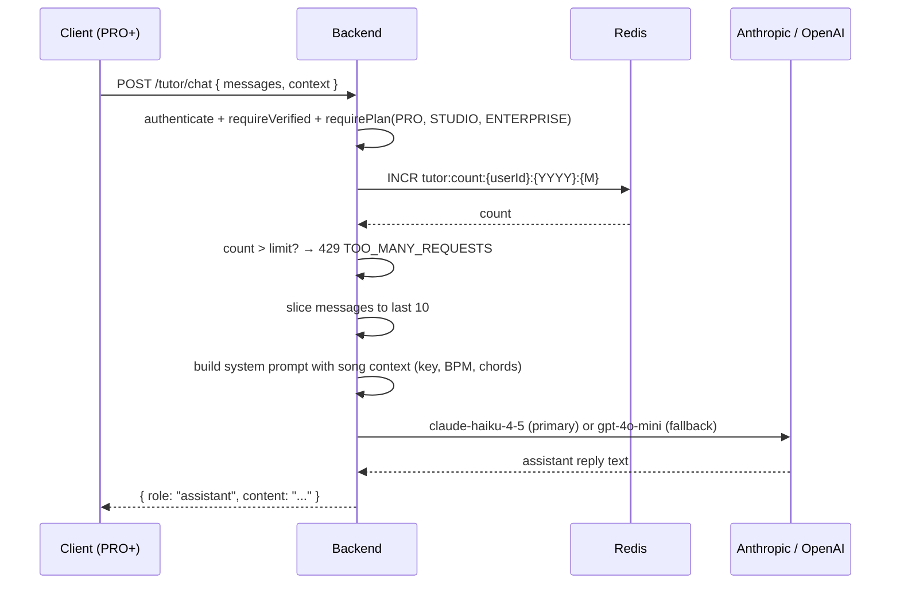

# Wilsify AI — Architecture

## Overview

Wilsify AI is a distributed system built from four independently deployable services communicating over HTTP and a shared Redis queue.

| Service | Language | Port | Responsibility |
|---|---|---|---|
| Backend | Node.js / Fastify | 4000 | REST API, auth, billing, WebSocket, job dispatch |
| AI Service | Python / FastAPI | 8000 | Audio analysis, tutor, real-time chord detection |
| Web Dashboard | Next.js 14 | 3000 | Browser UI |
| Mobile App | Expo / React Native | N/A | iOS + Android |

---

## System Diagram



---

## Request Lifecycle

### Standard authenticated request

```text
Client ──► POST /api/v1/uploads/file
         │ Authorization: Bearer <access_token>
         │
         ▼
Fastify authenticate middleware
  ├─ jwtVerify() → extracts { id, email, plan, role }
  └─ requireVerified() → DB lookup for isVerified flag
         │
         ▼
Upload route handler
  1. Check credit balance (CreditService.getBalance)
  2. Upload file to R2 (UploadService.uploadAudioFile)
  3. Create Song record (SongService.create)
  4. Deduct 1 credit (CreditService.spend)
  5. Enqueue BullMQ job (AnalysisService.requestAnalysis)
         │
         ▼
Response 201 { songId, song, size }

         ┆ (async — BullMQ worker picks up job)
         ▼
analysis.worker.ts
  1. Update Analysis status → PROCESSING
  2. POST /api/analyze to the AI service (with X-Internal-Secret)
  3. Wait up to 10 minutes for response
  4. Write results to Analysis + Chord tables
  5. Update Song.status → COMPLETED
  6. Create Notification record
  7. Send Expo push notification (if token registered)
  8. Emit Socket.IO "analysis:complete" event to user's socket
```

---

## Authentication Flow



JWT payload: `{ id, email, plan, role, iat, exp }`

Access token TTL: 15 minutes. Refresh token TTL: 30 days (rotated on every use).

**Email verification** is checked live from the database (not from the JWT) on every request to upload and tutor endpoints, so plan/verified status changes take effect immediately without requiring a new token.

---

## Upload Flow



---

## AI Processing Pipeline

Full pipeline for `POST /api/analyze` (runs synchronously, up to 10 min):

```text
1. load_audio()
   └─ yt-dlp (YouTube) or direct download → librosa.load() → (y, sr, duration, tmp_dir)

2. detect_bpm_multi()
   └─ librosa.beat.beat_track() × 3 tempos → consensus → BpmResult { bpm, confidence, beat_times }

3. detect_key()
   └─ librosa chroma → Krumhansl-Schmuckler profile correlation → KeyResult { key, mode, camelot_key }

4. detect_scale()
   └─ librosa chroma → pitch class scores → ScaleResult { scale }

5. Energy
   └─ librosa.feature.rms() → normalised float [0, 1]

6. detect_chords()
   └─ basic-pitch → note events → template matching → ChordResult { chords[] }

7. rate_difficulty()  [if include_difficulty]
   └─ heuristic scorer on BPM + chord count + chord quality → DifficultyResult { score, label }

8. generate_midi_for_song()  [if R2 configured]
   └─ music21 stream → MIDI bytes → R2 upload → midi_url

9. generate_sheet_music()  [if include_sheet and ENABLE_SHEET]
   └─ music21 → LilyPond → PDF → R2 upload → sheet_url

10. separate_stems()  [if include_stems and ENABLE_STEMS]
    └─ Demucs htdemucs → vocals / drums / bass / other WAVs → R2 upload × 4
```

---

## Tutor Flow



Monthly limits: PRO = 500, STUDIO = 2000, ENTERPRISE = unlimited.

---

## Billing Flow

### Stripe (international)

```text
Client → POST /subscriptions/order { plan, billing, provider: "stripe" }
       → stripe.createOrder() → Stripe Checkout Session
       → Client completes Stripe payment
       → POST /subscriptions/verify { orderId, paymentId, provider: "stripe" }
       → stripe.verifyPurchase() → upsertSubscription()

Async: Stripe → POST /webhooks/stripe
       → verifyWebhookSignature (HMAC-SHA256)
       → isDuplicateWebhookEvent() check (Redis NX, 24h TTL)
       → handleWebhook():
           customer.subscription.updated  → upsertSubscription
           customer.subscription.deleted  → expireSubscription + email
           invoice.payment_failed         → status = past_due + email
```

### Razorpay (India)

Same pattern; `verifyPurchase()` validates HMAC-SHA256 of `orderId|paymentId` using `timingSafeEqual`.

### Apple IAP / Google Play

Mobile-only. Client sends receipt/purchaseToken to `/subscriptions/apple/verify` or `/subscriptions/google/verify`. Backend validates against Apple/Google servers and upserts subscription.

---

## Queue System

Two BullMQ queues, both backed by Redis:

| Queue | Purpose | Concurrency | Retries |
|---|---|---|---|
| `analysis` | Full-song analysis jobs | 2 per worker | 3 × exponential backoff (5s base) |
| `scheduler` | Monthly credit reset cron | 1 | 1 |

The `scheduler` queue has a repeatable job with cron `0 0 1 * *` (1st of month, 00:00 UTC) and a stable `jobId` to prevent duplicate repeatables on restart.

Redis also stores:
- Webhook idempotency keys: `whk:{provider}:{eventId}` (24h TTL)
- Tutor monthly counters: `tutor:count:{userId}:{YYYY}:{M}` (32-day TTL)

---

## Socket.IO Events

The backend mounts a Socket.IO server on the same HTTP port (4000) as the REST API. All connections require a valid JWT passed in `socket.handshake.auth.token`.

### Server → Client

| Event | Payload | When |
|---|---|---|
| `analysis:complete` | `{ songId, analysisId, bpm, keySignature, chordCount }` | Analysis worker finishes a job |
| `live:chord-detected` | `{ chord, confidence, timestamp, bpm? }` | Real-time chunk forwarded from AI service |
| `live:session-started` | — | Server acknowledges `live:start` |
| `live:session-stopped` | — | Server acknowledges `live:stop` |
| `live:error` | `{ message }` | AI service chunk error |

### Client → Server

| Event | Payload | When |
|---|---|---|
| `live:start` | — | User starts live chord detection |
| `live:stop` | — | User stops live session |
| `live:audio-chunk` | `{ data: ArrayBuffer, sampleRate, channels }` | PCM audio frame from microphone |

---

## Database Relationships

```text
User
 ├─── Song[] (userId FK)
 │     └─── Analysis (songId FK, 1:1)
 │           └─── Chord[] (analysisId FK)
 ├─── RefreshToken[] (userId FK)
 ├─── PasswordReset[] (userId FK)
 ├─── EmailVerification[] (userId FK)
 ├─── CreditLedger[] (userId FK)
 ├─── Subscription? (userId FK, 1:1)
 ├─── Notification[] (userId FK)
 ├─── CommunityPost[] (userId FK)
 └─── PostLike[] (userId FK)

CommunityPost
 ├─── PostLike[] (postId FK)
 └─── Song? (songId FK, nullable)
```

Full schema documented in [DATABASE.md](DATABASE.md).

---

## Security Model

| Concern | Mechanism |
|---|---|
| Authentication | JWT (15m access) + httpOnly refresh cookie (30d, rotated) |
| Email verification | DB-checked `isVerified` flag; required before uploads and tutor |
| Plan enforcement | `requirePlan()` middleware; stem/sheet entitlements baked into BullMQ job |
| AI service auth | `X-Internal-Secret` header on all internal calls; startup FATAL if unset in production |
| Payment signature | `timingSafeEqual` on HMAC-SHA256 for both Razorpay verify + webhook |
| Webhook replay | Redis NX idempotency key (24h TTL) on all four webhook handlers |
| Rate limiting | `@fastify/rate-limit` globally; tighter limits on auth endpoints (5–10 req/15min) |
| File validation | MIME type + extension check in `UploadService` |
| Error responses | 4xx errors never leak stack traces; 5xx returns generic message |
| CORS | `ALLOWED_ORIGINS` env var; restricted to known origins in production |

Full details in [SECURITY.md](../deployment/SECURITY.md).

---

## Related Documents

- [API.md](API.md) — full endpoint reference for the flows diagrammed above
- [DATABASE.md](DATABASE.md) — full schema behind the Database Relationships diagram
- [../deployment/SECURITY.md](../deployment/SECURITY.md) — full security model
- [../product/PRODUCT.md](../product/PRODUCT.md) — why these services and modules exist
- [../README.md](../README.md) — documentation map
