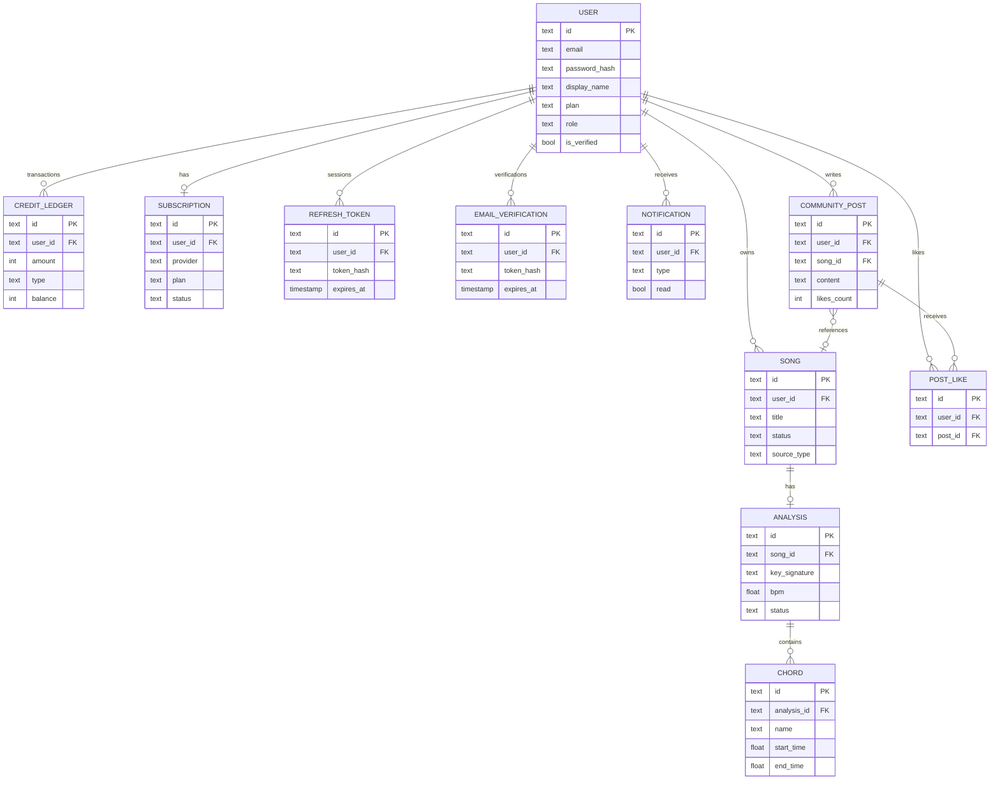

# Wilsify AI — Database

**Engine:** PostgreSQL 16

**ORM:** Prisma 6 (schema at `backend/prisma/schema.prisma`)

---

## Tables

| Table | Rows (est.) | Purpose |
|---|---|---|
| `users` | ~1k | Accounts, plan, verification status |
| `refresh_tokens` | ~3k | Active refresh token hashes |
| `password_resets` | ~100 | One-time password reset tokens |
| `email_verifications` | ~500 | Email verification tokens |
| `songs` | ~10k | Uploaded or YouTube songs |
| `analyses` | ~10k | Per-song analysis results (1:1 with songs) |
| `chords` | ~500k | Detected chords (many per analysis) |
| `credit_ledger` | ~30k | Immutable credit transaction log |
| `subscriptions` | ~200 | Active paid subscriptions (1:1 with user) |
| `notifications` | ~50k | In-app notification inbox |
| `community_posts` | ~5k | Community feed posts |
| `post_likes` | ~20k | Post ↔ user like junction |

---

## Schema

### `users`

```sql
CREATE TABLE users (
  id            TEXT      PRIMARY KEY,   -- cuid()
  email         TEXT      NOT NULL UNIQUE,
  password_hash TEXT      NOT NULL,
  display_name  TEXT      NOT NULL,
  avatar_url    TEXT,
  instrument    TEXT,
  plan          TEXT      NOT NULL DEFAULT 'FREE',  -- FREE | PRO | STUDIO | ENTERPRISE
  role          TEXT      NOT NULL DEFAULT 'USER',  -- USER | MODERATOR | ADMIN
  is_verified   BOOLEAN   NOT NULL DEFAULT FALSE,
  push_token    TEXT,                               -- Expo push notification token
  created_at    TIMESTAMP NOT NULL DEFAULT now(),
  updated_at    TIMESTAMP NOT NULL
);
CREATE UNIQUE INDEX users_email_idx ON users(email);
```

**Plans:** `FREE` → `PRO` → `STUDIO` → `ENTERPRISE`

**Roles:** `USER` (default), `MODERATOR`, `ADMIN`

`is_verified` is set to `true` only after the user clicks the email verification link. Uploads and tutor are blocked until verified.

---

### `refresh_tokens`

```sql
CREATE TABLE refresh_tokens (
  id         TEXT      PRIMARY KEY,
  user_id    TEXT      NOT NULL REFERENCES users(id) ON DELETE CASCADE,
  token_hash TEXT      NOT NULL UNIQUE,  -- SHA-256 of raw token
  expires_at TIMESTAMP NOT NULL,
  revoked    BOOLEAN   NOT NULL DEFAULT FALSE,
  created_at TIMESTAMP NOT NULL DEFAULT now()
);
CREATE INDEX refresh_tokens_user_id_idx ON refresh_tokens(user_id);
CREATE INDEX refresh_tokens_token_hash_idx ON refresh_tokens(token_hash);
```

Raw tokens are never stored. The hash is looked up on each `/auth/refresh` call. Tokens are rotated (old deleted, new created) on every successful refresh.

---

### `password_resets`

```sql
CREATE TABLE password_resets (
  id         TEXT      PRIMARY KEY,
  user_id    TEXT      NOT NULL REFERENCES users(id) ON DELETE CASCADE,
  token_hash TEXT      NOT NULL UNIQUE,
  expires_at TIMESTAMP NOT NULL,
  used       BOOLEAN   NOT NULL DEFAULT FALSE,
  created_at TIMESTAMP NOT NULL DEFAULT now()
);
CREATE INDEX password_resets_token_hash_idx ON password_resets(token_hash);
```

Token TTL: 1 hour. Marked `used = true` after successful password reset.

---

### `email_verifications`

```sql
CREATE TABLE email_verifications (
  id         TEXT      PRIMARY KEY,
  user_id    TEXT      NOT NULL REFERENCES users(id) ON DELETE CASCADE,
  token_hash TEXT      NOT NULL UNIQUE,
  expires_at TIMESTAMP NOT NULL,
  used       BOOLEAN   NOT NULL DEFAULT FALSE,
  created_at TIMESTAMP NOT NULL DEFAULT now()
);
CREATE INDEX email_verifications_token_hash_idx ON email_verifications(token_hash);
```

Token TTL: 24 hours. On `resend-verification`, previous tokens for the user are expired (set `expiresAt = now()`) before creating a new one.

---

### `songs`

```sql
CREATE TABLE songs (
  id            TEXT      PRIMARY KEY,
  user_id       TEXT      NOT NULL REFERENCES users(id) ON DELETE CASCADE,
  title         TEXT      NOT NULL,
  artist        TEXT,
  duration      FLOAT,                -- seconds (filled by AI worker)
  bpm           FLOAT,                -- denormalised from analysis for quick display
  key_signature TEXT,                 -- denormalised
  emoji         TEXT,
  is_public     BOOLEAN   NOT NULL DEFAULT FALSE,
  file_url      TEXT,                 -- R2 public URL (for file uploads)
  file_key      TEXT,                 -- R2 object key
  source_type   TEXT      NOT NULL DEFAULT 'file',  -- 'file' | 'youtube'
  source_url    TEXT,                 -- YouTube URL
  status        TEXT      NOT NULL DEFAULT 'QUEUED', -- QUEUED | PROCESSING | COMPLETED | FAILED
  created_at    TIMESTAMP NOT NULL DEFAULT now(),
  updated_at    TIMESTAMP NOT NULL
);
CREATE INDEX songs_user_id_idx ON songs(user_id);
CREATE INDEX songs_created_at_idx ON songs(created_at DESC);
```

---

### `analyses`

One-to-one with `songs`. Created when a song is queued for analysis.

```sql
CREATE TABLE analyses (
  id                TEXT      PRIMARY KEY,
  song_id           TEXT      NOT NULL UNIQUE REFERENCES songs(id) ON DELETE CASCADE,
  key_signature     TEXT,
  bpm               FLOAT,
  mode              TEXT,     -- 'major' | 'minor', from the AI service's key detection
  scale             TEXT,
  camelot_key       TEXT,
  energy            FLOAT,    -- normalised RMS energy [0, 1]
  difficulty_score  FLOAT,    -- AI-computed 0-10 score; top-level for future search/filter/analytics
  difficulty_label  TEXT,     -- 'Beginner'..'Expert'; top-level for the same reason
  difficulty_detail JSONB,    -- sub-factor breakdown (bpmFactor, chordComplexity, chordVariety, changeRate); explanatory only
  midi_ready        BOOLEAN   NOT NULL DEFAULT FALSE,
  sheet_ready       BOOLEAN   NOT NULL DEFAULT FALSE,
  midi_url          TEXT,     -- R2 public URL
  sheet_url         TEXT,     -- R2 public URL
  status            TEXT      NOT NULL DEFAULT 'QUEUED',
  error_message     TEXT,
  created_at        TIMESTAMP NOT NULL DEFAULT now(),
  updated_at        TIMESTAMP NOT NULL
);
```

`difficulty_score` and `difficulty_label` are the two columns expected to gain an index once song search/filtering ships — not indexed yet, since no current query filters or sorts on them.

---

### `chords`

Many per analysis. Created in bulk when the worker writes results.

```sql
CREATE TABLE chords (
  id          TEXT    PRIMARY KEY,
  analysis_id TEXT    NOT NULL REFERENCES analyses(id) ON DELETE CASCADE,
  name        TEXT    NOT NULL,   -- e.g. "Am7"
  root        TEXT    NOT NULL,   -- e.g. "A"
  quality     TEXT    NOT NULL,   -- e.g. "minor7"
  start_time  FLOAT   NOT NULL,   -- seconds
  end_time    FLOAT   NOT NULL,
  confidence  FLOAT   NOT NULL,   -- [0, 1]
  position    INT     NOT NULL    -- ordering index
);
CREATE INDEX chords_analysis_id_idx ON chords(analysis_id);
```

---

### `credit_ledger`

Immutable append-only ledger. Balance is denormalised per row (running total).

```sql
CREATE TABLE credit_ledger (
  id         TEXT      PRIMARY KEY,
  user_id    TEXT      NOT NULL REFERENCES users(id) ON DELETE CASCADE,
  amount     INT       NOT NULL,  -- positive = EARN, negative = SPEND
  type       TEXT      NOT NULL,  -- 'EARN' | 'SPEND'
  reason     TEXT      NOT NULL,  -- human-readable description
  balance    INT       NOT NULL,  -- balance after this transaction
  created_at TIMESTAMP NOT NULL DEFAULT now()
);
CREATE INDEX credit_ledger_user_id_idx ON credit_ledger(user_id);
CREATE INDEX credit_ledger_created_at_idx ON credit_ledger(created_at DESC);
```

Current balance = `balance` field of the most recent row for the user. No separate balance column exists — avoids race conditions.

---

### `subscriptions`

One-to-one with `users`.

```sql
CREATE TABLE subscriptions (
  id                  TEXT      PRIMARY KEY,
  user_id             TEXT      NOT NULL UNIQUE REFERENCES users(id) ON DELETE CASCADE,
  provider            TEXT      NOT NULL,  -- 'stripe' | 'razorpay' | 'apple' | 'google'
  provider_id         TEXT      NOT NULL UNIQUE,  -- Stripe subscription ID / Razorpay order ID / etc.
  plan                TEXT      NOT NULL,  -- PRO | STUDIO | ENTERPRISE
  status              TEXT      NOT NULL,  -- 'active' | 'cancelled' | 'expired' | 'past_due'
  current_period_end  TIMESTAMP NOT NULL,
  cancel_at_period_end BOOLEAN  NOT NULL DEFAULT FALSE,
  metadata            JSONB,
  created_at          TIMESTAMP NOT NULL DEFAULT now(),
  updated_at          TIMESTAMP NOT NULL
);
CREATE INDEX subscriptions_provider_id_idx ON subscriptions(provider_id);
```

---

### `notifications`

```sql
CREATE TABLE notifications (
  id         TEXT      PRIMARY KEY,
  user_id    TEXT      NOT NULL REFERENCES users(id) ON DELETE CASCADE,
  title      TEXT      NOT NULL,
  body       TEXT      NOT NULL,
  type       TEXT      NOT NULL,  -- analysis_complete | like | comment | system | payment
  read       BOOLEAN   NOT NULL DEFAULT FALSE,
  metadata   JSONB,
  created_at TIMESTAMP NOT NULL DEFAULT now()
);
CREATE INDEX notifications_user_id_idx ON notifications(user_id);
CREATE INDEX notifications_read_idx    ON notifications(read);
CREATE INDEX notifications_created_at_idx ON notifications(created_at DESC);
```

---

### `community_posts`

```sql
CREATE TABLE community_posts (
  id          TEXT      PRIMARY KEY,
  user_id     TEXT      NOT NULL REFERENCES users(id) ON DELETE CASCADE,
  song_id     TEXT      REFERENCES songs(id) ON DELETE SET NULL,
  content     TEXT      NOT NULL,
  tag         TEXT,
  likes_count INT       NOT NULL DEFAULT 0,
  created_at  TIMESTAMP NOT NULL DEFAULT now(),
  updated_at  TIMESTAMP NOT NULL
);
CREATE INDEX community_posts_created_at_idx  ON community_posts(created_at DESC);
CREATE INDEX community_posts_likes_count_idx ON community_posts(likes_count DESC);
```

---

### `post_likes`

Junction table. Unique constraint prevents duplicate likes.

```sql
CREATE TABLE post_likes (
  id         TEXT      PRIMARY KEY,
  user_id    TEXT      NOT NULL REFERENCES users(id) ON DELETE CASCADE,
  post_id    TEXT      NOT NULL REFERENCES community_posts(id) ON DELETE CASCADE,
  created_at TIMESTAMP NOT NULL DEFAULT now(),
  UNIQUE(user_id, post_id)
);
CREATE INDEX post_likes_post_id_idx ON post_likes(post_id);
```

---

## Entity-Relationship Diagram



---

## Credit System

Credits are the unit of consumption for analysis jobs. Every analysis costs 1 credit.

### Rules

1. `CreditService.spend()` checks balance before deducting — throws `INSUFFICIENT_CREDITS` if `balance < amount`.
2. Balance is read from the last row in `credit_ledger` for the user (not a separate column).
3. Monthly reset runs at 00:00 UTC on the 1st of every month via BullMQ cron. It calls `resetMonthlyCredits()` for every user, which tops up credits to the plan limit if the current balance is below it (does not reduce a balance above the limit).

### Plan allocations

| Plan | Monthly credits |
|---|---|
| FREE | 50 |
| PRO | 2,500 |
| STUDIO | 5,000 |
| ENTERPRISE | 50,000 |

---

## Subscription System

Subscriptions are managed per-provider:

- **Stripe:** `subscription.updated/deleted` webhooks drive state.
- **Razorpay:** `payment.captured` activates; `subscription.cancelled/expired` deactivates.
- **Apple IAP:** `App Store Server Notifications` (signed JWS) drive state.
- **Google Play:** Pub/Sub `DeveloperNotification` messages drive state.

All webhooks are idempotent via Redis NX check (24-hour key TTL).

Subscription statuses: `active` → `past_due` (payment failed) → `cancelled` (user cancelled) → `expired` (period ended).

---

## Migrations

Prisma migrations are stored in `backend/prisma/migrations/`.

Apply migrations:

```bash
# Development (creates migration file, applies, regenerates client)
cd backend && npm run db:migrate

# Production (applies pending migrations only, no file creation)
cd backend && npm run db:migrate:deploy
# This command also runs automatically on every Railway deploy via railway.json's deploy.startCommand
```

Generate the Prisma client after schema changes:

```bash
cd backend && npm run db:generate
```

---

## Indexes

Currently defined indexes:

| Table | Column(s) | Type | Purpose |
|---|---|---|---|
| `users` | `email` | UNIQUE | Login lookup |
| `songs` | `user_id` | Standard | List songs by user |
| `songs` | `created_at DESC` | Standard | Paginated song list |
| `analyses` | `song_id` | UNIQUE | Analysis lookup |
| `chords` | `analysis_id` | Standard | Load chords for analysis |
| `credit_ledger` | `user_id` | Standard | Balance lookup |
| `credit_ledger` | `created_at DESC` | Standard | History pagination |
| `subscriptions` | `provider_id` | Standard | Webhook lookup by provider subscription ID |
| `refresh_tokens` | `user_id` | Standard | Logout (delete all tokens for user) |
| `refresh_tokens` | `token_hash` | UNIQUE | Refresh lookup |
| `password_resets` | `token_hash` | UNIQUE | Reset lookup |
| `email_verifications` | `token_hash` | UNIQUE | Verification lookup |
| `notifications` | `user_id` | Standard | Notification list |
| `notifications` | `read` | Standard | Unread count |
| `notifications` | `created_at DESC` | Standard | Ordered display |
| `community_posts` | `created_at DESC` | Standard | Feed ordering |
| `community_posts` | `likes_count DESC` | Standard | Trending tab |
| `post_likes` | `post_id` | Standard | Like count |
| `post_likes` | `(user_id, post_id)` | UNIQUE | Prevent duplicate likes |

**Known missing indexes (post-launch backlog):**
- `subscriptions(user_id, status)` — composite for subscription lookups
- `notifications(user_id, read)` — composite for unread badge count

---

## Related Documents

- [ARCHITECTURE.md](ARCHITECTURE.md) — how this schema is used across the request lifecycle
- [API.md](API.md) — endpoints that read and write these tables
- [../deployment/BACKUP_STRATEGY.md](../deployment/BACKUP_STRATEGY.md) — backup and restore procedures for this database
- [../README.md](../README.md) — documentation map
